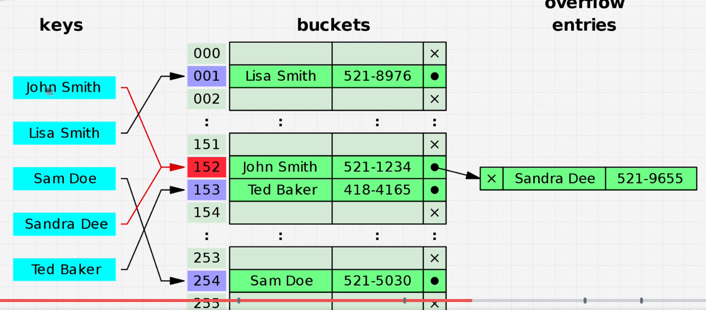
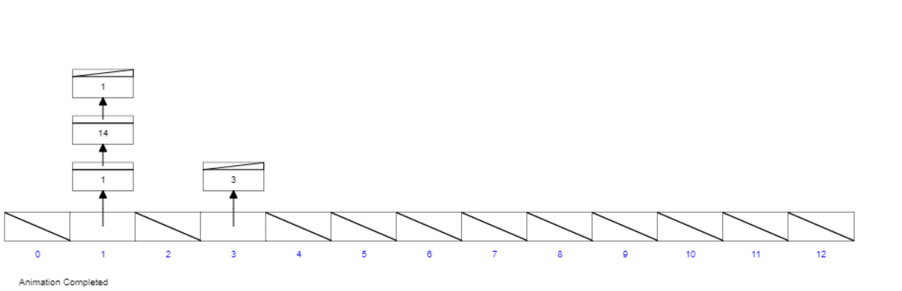

# Data structure: **Hash Table**

> [Visualization](https://www.cs.usfca.edu/~galles/visualization/OpenHash.html)

## Pros
- Fast lookups(Good collission resolution needed)
- Fast inserts
- Flexible keys

## Cons
- Unordered
- Slow key interation

---


## Big-O
|Action|Big-O|
|:-----|-------:|
|Lookup (collission)|O(1)|
|Lookup (Without collission)|O(n)|
|Search|O(1)|
|Insert|O(1)|
|Delete|O(1)|

---

## Improve Time Complexity?  
> Fast Access O(1), tradeoff: more memory O(n)

--- 

## Hash function
- [MD5](http://www.miraclesalad.com/webtools/md5.php)


## Hash Colission
- If `Hash table` to small then `hash value` posible to duplicate called `overflow entries`





---

## Code example
``` java script
let user = {
  age: 54,
  name: 'Kylie',
  magic: true,
  scream: function() {
    console.log('ahhhhhh!');
  }
};

user.age; // search
user.spell = 'abra kadabra'; // insearch
user.scream() // lookup
```

``` javascript
class HashTable {
  constructor(size){
    this.data = new Array(size);
    // this.data = [];
  }

  // `_` show before method is provate method
  _hash(key) { 
    let hash = 0;
    for (let i =0; i < key.length; i++){
        hash = (hash + key.charCodeAt(i) * i) % this.data.length
    }
    return hash;
  }

  set(key, value) {
    let address = this._hash(key);
    if (!this.data[address]) {
      this.data[address] = [];
    }
    this.data[address].push([key, value]); // solved colission and store new value to hash table
    return this.data;
  }

  get(key){
    const address = this._hash(key);
    const currentBucket = this.data[address]
    if (currentBucket) {
      for(let i = 0; i < currentBucket.length; i++){
        // find until found key
        if(currentBucket[i][0] === key) {
          return currentBucket[i][1]
        }
      }
    }
    return undefined;
  }

  keys(){
    if (!this.data.length) {
      return undefined
    }

    const keysArray = [];
    console.log(this.data.length);
    for (let i = 0; i < this.data.length; i++){
      if(this.data[i] && this.data[i].length){
        keysArray.push(this.data[i][0][0])

        // but also loop through all the potential collisions
        // if (this.data.length > 1) {
        //   for (let j = 0; j < this.data[i].length; j++) {
        // TODO: get all key support Without Collision
        //     result.push(this.data[i][j][0])
        //   }
        // } else {
        //   result.push(this.data[i][0])
        // } 
      }
    }
    return keysArray;
  }
}

const myHashTable = new HashTable(50);
myHashTable.set('grapes', 10000)
myHashTable.get('grapes') // 10000
myHashTable.set('apples', 9)
myHashTable.get('apples') // 9
myHashTable.keys() // ['grapes', 'apples']
```

### First Recurring Charecter
``` javascript
//Google Question
//Given an array = [2,5,1,2,3,5,1,2,4]:
//It should return 2

//Given an array = [2,1,1,2,3,5,1,2,4]:
//It should return 1

//Given an array = [2,3,4,5]:
//It should return undefined


function firstRecurringCharacter(input) {
  for (let i = 0; i < input.length; i++) {
    for (let j = i + 1; j < input.length; j++) {
      if(input[i] === input[j]) {
        return input[i];
      }
    }
  }
  return undefined
}
// O(n^2)
// For space complexity O(1)

function firstRecurringCharacter2(input) {
  let map = {};
  for (let i = 0; i < input.length; i++) {
    if (map[input[i]] !== undefined) {
      return input[i]
    } else {
      map[input[i]] = i;
    }
  }
  return undefined
}
// O(n)

firstRecurringCharacter2([1,5,5,1,3,4,6])


//Bonus... What if we had this:
// [2,5,5,2,3,5,1,2,4]
// return 5 because the pairs are before 2,2
```