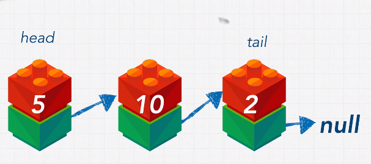
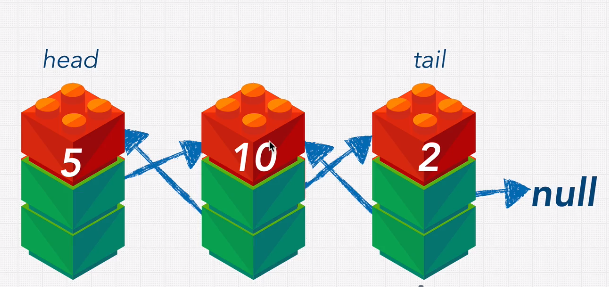

# Data structure : **Linked Listse**

> [Visualize](https://visualgo.net/en/list)

- Singly


- Doubly: faster than the singly linked lists but use more memory space



---

## Big-O
|Action|Big-O|
|:-----|-------:|
|Lookup|O(n)|
|Search|O(n)|
|Append|O(1)|
|Prepend|O(1)|
|Delete|O(n)|

---

## Pros
- Fast insertion
- Fast Deletion
- Ordered
- Flexible Size

## Cons
- Slow Lookup
- More Memory

---

## Code Example

### Pointer
``` javascript
const obj1 = {a: true};
const obj2 = obj1;
obj1.a = 'booya';
// delete obj1;
// obj2 = 'hello';
console.log('1', obj1); // {a: 'booya'}
console.log('2', obj2); // {a: 'booya'}
//Because `obj2` point to memory address of `obj1`
```
## Singly Linked Lists
``` javascript
const obj1 = {a: true};
const obj2 = obj1;
obj1.a = 'booya';
delete obj1;
console.log('2', obj2); // {a: 'booya'}
//Because `obj2` point to memory address of `obj1`
```

``` javascript
class LinkedList {
  constructor(value) {
    this.head = {
      value: value,
      next: null
    };
    this.tail = this.head; // pointer to `head`
    this.length = 1;
  }
  append(value) {
    const newNode = {
      value: value,
      next: null
    }
    console.log(newNode)
    this.tail.next = newNode;  // like `head`.next
    this.tail = newNode; // assign new tail to `newNode`(`newNode` use same memory address with `head.next`)
    this.length++;
    return this;
  }
  prepend(value) {
    const newNode = {
      value: value,
      next: null
    }
    newNode.next = this.head;// assign ole `head` to `newNode`
    this.head = newNode; // change `head` to `newNode` and remove old `head` on memory(grabage collection)
    this.length++;
    return this;
  }
  printList() {
    const array = [];
    let currentNode = this.head;
    while(currentNode !== null){
        array.push(currentNode.value)
        currentNode = currentNode.next
    }
    return array;
  }
  insert(index, value){
    //Check for proper parameters;
    if(index >= this.length) {
      console.log('yes')
      return this.append(value);
    }
    
    const newNode = {
      value: value,
      next: null
    }
    const leader = this.traverseToIndex(index-1);
    const holdingPointer = leader.next;
    leader.next = newNode;
    newNode.next = holdingPointer;
    this.length++;
    return this.printList();
  }
  traverseToIndex(index) {
    //Check parameters
    let counter = 0;
    let currentNode = this.head;
    while(counter !== index){
      currentNode = currentNode.next;
      counter++;
    }
    return currentNode;
  }
  remove(index) {
    // Check Parameters      
    const leader = this.traverseToIndex(index-1);
    const unwantedNode = leader.next;
    leader.next = unwantedNode.next;
    this.length--;
    return this.printList();
  }
  reverse() {
      if (!this.head.next) {
        return this.head;
      }
      let first = this.head;
      this.tail = this.head;
      let second = first.next;
  
      while(second) {
        const temp = second.next;
        second.next = first;
        first = second;
        second = temp;
      }
  
      this.head.next = null;
      this.head = first;
      return this.printList();
    }
}

let myLinkedList = new LinkedList(10);
myLinkedList.append(5);
myLinkedList.append(16);
myLinkedList.prepend(1);
myLinkedList.insert(2, 99);
myLinkedList.insert(20, 88);
myLinkedList.remove(2);
myLinkedList.reverse();
```

## Doubly Linked Lists
``` javascript
class DoublyLinkedList {
  constructor(value) {
    this.head = {
      value: value,
      next: null,
      prev: null
    };
    this.tail = this.head;
    this.length = 1;
  }
  append(value) {
    const newNode = {
      value: value,
      next: null,
      prev: null
    }
    console.log(newNode)
    newNode.prev = this.tail
    this.tail.next = newNode;
    this.tail = newNode;
    this.length++;
    return this;
  }
  prepend(value) {
    const newNode = {
      value: value,
      next: null,
      prev: null
    }
    newNode.next = this.head;
    this.head.prev = newNode
    this.head = newNode;
    this.length++;
    return this;
  }
  printList() {
    const array = [];
    let currentNode = this.head;
    while(currentNode !== null){
      array.push(currentNode.value)
      currentNode = currentNode.next
    }
    return array;
  }
  insert(index, value){
    //Check for proper parameters;
    if(index >= this.length) {
      return this.append(value);
    }
    
    const newNode = {
      value: value,
      next: null,
      prev: null
    }
    const leader = this.traverseToIndex(index-1);
    const follower = leader.next;
    leader.next = newNode;
    newNode.prev = leader;
    newNode.next = follower;
    follower.prev = newNode;
    this.length++;
    console.log(this)
    return this.printList();
  }
  traverseToIndex(index) {
    //Check parameters
    let counter = 0;
    let currentNode = this.head;
    while(counter !== index){
      currentNode = currentNode.next;
      counter++;
    }
    return currentNode;
  }
}

let myLinkedList = new DoublyLinkedList(10);
myLinkedList.append(5)
myLinkedList.append(16)
myLinkedList.prepend(1)
myLinkedList.insert(2, 99)
// myLinkedList.insert(20, 88)
// myLinkedList.printList()
// myLinkedList.remove(2)
// myLinkedList.reverse()
```